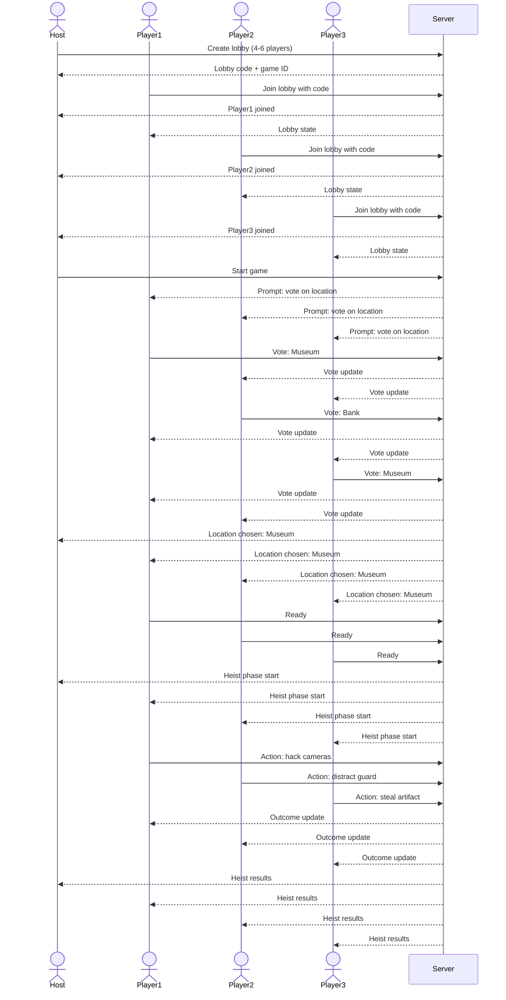

# The Quisling

This application is a group heist game. Players can sign up, start or join rooms, and save or reference their profile info. 

## Specification Deliverable

### Elevator pitch

We all need a break soemtimes. Group games are the easiest way to escape reality. When they are collaborative, require skill, creativity, and focus, they foster an even more immersive expereince, especially when there are high stakes and conflicting motives at play. The Quisling is designed to be played like a collaborative heist board game. Players are given roles which determine their part in each heist, and winning looks different for each user. The design is simple - users log in, join rooms, and compete to accomplish or sabatoge heists. Let the fun begin.

### Design

Here is a sequence diagram that shows how a group would interact with the app during a game.

### Key features

- Secure login over HTTPS
- Ability to vote on heist location
- Display of location choices
- Ability for different roles to perform unique tasks
- Voting displayed in real time
- Results are persistently stored until game end

### Technologies

I am going to use the required technologies in the following ways:

- **HTML** - Two HTML pages. One for login and one for game view.
- **CSS** - Application styling that looks good on different screen sizes, uses game-like color choice.
- **React** - Provides login, gameview interactivity, applying votes, and display other users votes.
- **Service** - Backend service with endpoints for:
  - login
  - submitting votes
  - retrieving vote status
- **DB/Login** - Store users, games played, wins, and win rate in database. Register and login users. Credentials securely stored in database. Can't play unless logged in.
- **WebSocket** - As each user votes, their votes are broadcast to all other users.

## HTML deliverable

For this deliverable I built out the structure of my application using HTML.

- [x] **HTML pages** - Two HTML page that represent the ability to login and vote.
- [x] **Links** - The login page automatically links to the voter page. The voter page contains links for every voting choice.
- [x] **Text** - Each of the voting choices is represented by a textual description.
- [ ] **Images** - I couldn't figure out how to include an image and so I didn't do this. 😔
- [x] **DB/Login** - Input box and submit button for login. The voting choices represent data pulled from the database.
- [x] **WebSocket** - The count of voting results represent the tally of realtime votes.

## CSS deliverable

For this deliverable I properly styled the application into its final appearance.

- [x] **Header, footer, and main content body**
- [x] **Navigation elements** - I dropped the underlines and changed the color for anchor elements.
- [x] **Responsive to window resizing** - My app looks great on all window sizes and devices
- [x] **Application elements** - Used good contrast and whitespace
- [x] **Application text content** - Consistent fonts
- [ ] **Application images** - Still don't have images and so no styling here. 😔

## React Phase 1: Routing deliverable

For this deliverable I used JavaScript and React so that the application completely works for a single user. I also added placeholders for future technology.

- [x] **Bundled using Vite** - So amazing what Vite does. Bundling, transpiling, minifying, and HMR.
- [x] **Components** - I have three components: The app, the ballot items, and a bouncy ball.
- [x] **Router** - Routing between login and voting components.

- [x] **Bundled and transpiled** - done!
- [x] **Components** - Login, voting list, vote are all components with mocks for login, WebSocket.
  - [x] **login** - When you press enter or the login button it takes you to the voting page.
  - [x] **database** - Displayed the voting counts. Currently this is stored and retrieved from local storage, but it will be replaced with the database data later.
  - [x] **WebSocket** - I used the setInterval function to periodically increase a random vote count. This will be replaced with WebSocket messages later.
  - [x] **application logic** - The highlight and ranking number change based up the user's selections.
- [x] **Router** - Routing between login and voting components.
- [x] **Hooks** - Vue uses class properties instead of `UseState` to track changes in vote state.

## React Phase 2: Reactivity deliverable

For this deliverable I used JavaScript and React so that the application completely works for a single user. I also added placeholders for future technology.

- [x] **All functionality implemented or mocked out** - Everything is working! Votes stored in local storage. `setInterval` used to simulate peer voting.
- [x] **Hooks** - Used `useState` and `useEffect` on the voter view.

## Service deliverable

For this deliverable I added backend endpoints that receives votes and returns the voting totals.

- [x] **Node.js/Express HTTP service** - done!
- [x] **Static middleware for frontend** - done!
- [ ] **Calls to third party endpoints** - I didn't have time to implement this. 😔
- [x] **Backend service endpoints** - Placeholders for login that stores the current user on the server. Endpoints for voting.
- [x] **Frontend calls service endpoints** - I did this using the fetch function.
- [ ] **Supports registration, login, logout, and restricted endpoint** - Login only exists on the frontend.

## DB/Login deliverable

For this deliverable I associate the votes with the logged in user. I stored the votes in the database.

- [x] **Stores data in MongoDB** - done!
- [x] **Use MongoDB to store credentials** - Stores both user and their votes.

## WebSocket deliverable

For this deliverable I used webSocket to update the votes on the frontend in realtime.

- [x] **Backend listens for WebSocket connection** - done!
- [x] **Frontend makes WebSocket connection** - done!
- [x] **Data sent over WebSocket connection** - done!
- [x] **WebSocket data displayed** - All user votes display in realtime. I'm really proud that this is working. Way cool! 🎉 I'm going to celebrate with my bestie over waffles!